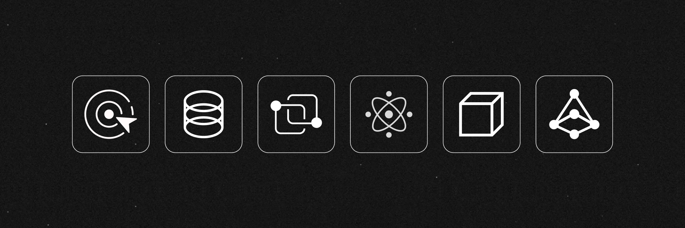

# Hello! I am Rishu.

Bachelors student in **Computer Science And Engineering**.
Fresher **software developer**.
Expert in **algorithms and data structures**.
Proficient in **Python** and **C++**.
Knowledgeable about **Kotlin** and **JavaScript**.
Experienced in **BackEnd Developement**, **Data Analytics**, **Machine Learning**.

- 🔭 I am currently working on a web scraping project.
- 🌱 I am currently learning Backend Development and ReactJS.
- 👯 I am looking to collaborate on open-source data analytics projects in Python
- 😀 I like making random programs for fun, watching anime, and playing video games in my free time
- 💬 Ask me about robust combinatorial optimization and cryptographic protocols
- 🥅 2024 Goals: publish an article, release 3 projects, solve all LeetCode problems
<!-- - ✨ Fun fact: I once learned to type at 120 WPM only to forget it all months later -->

## Competitive Programming

I love solving algorithmic puzzles in a time-constrained manner. Here are some of my stats: <!-- [stats](https://clist.by/coder/Sky_Nik/): -->

<!--  -->

To get started with competitive programming, check out [CSES Problem Set](https://cses.fi/problemset/), [USACO Guide](https://usaco.guide/), [Competitive Programmer's Handbook](https://cses.fi/book/book.pdf), and either [AtCoder Library](https://github.com/atcoder/ac-library) or [PyRival](https://github.com/cheran-senthil/PyRival). For additional resources, take a look at this [list](https://github.com/stars/nskybytskyi/lists/competitive-programming).

## Socials

Connect with me on:

<!--  -->
<!--  -->

<!--  -->
<!-- 
 -->

<!--  -->
